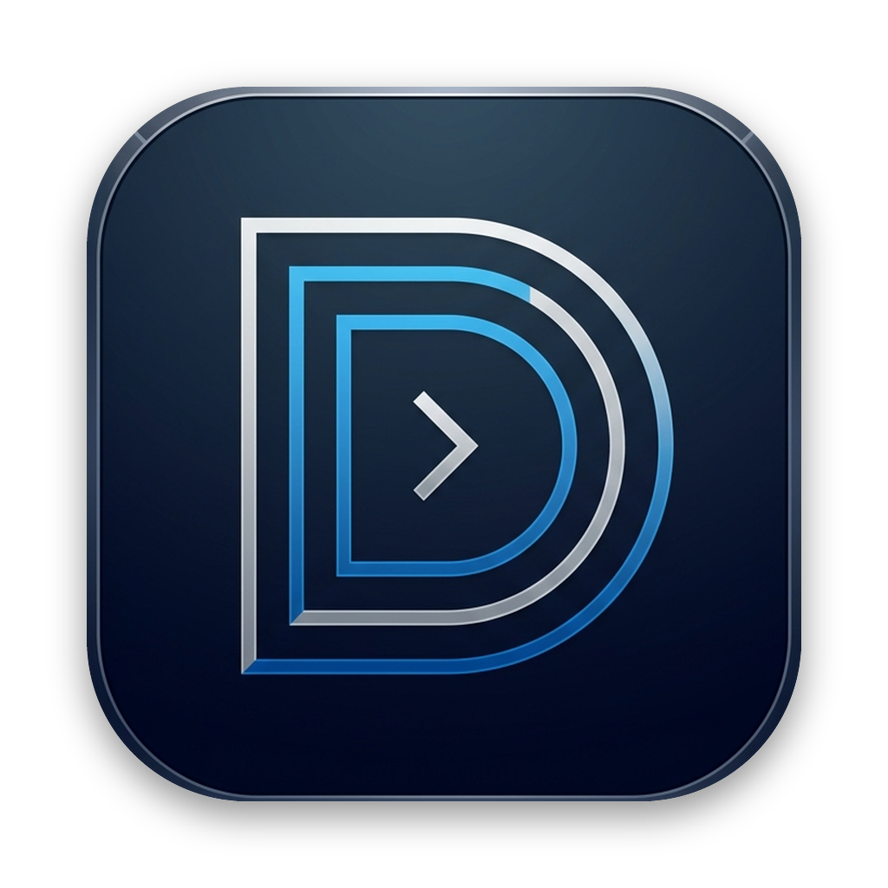
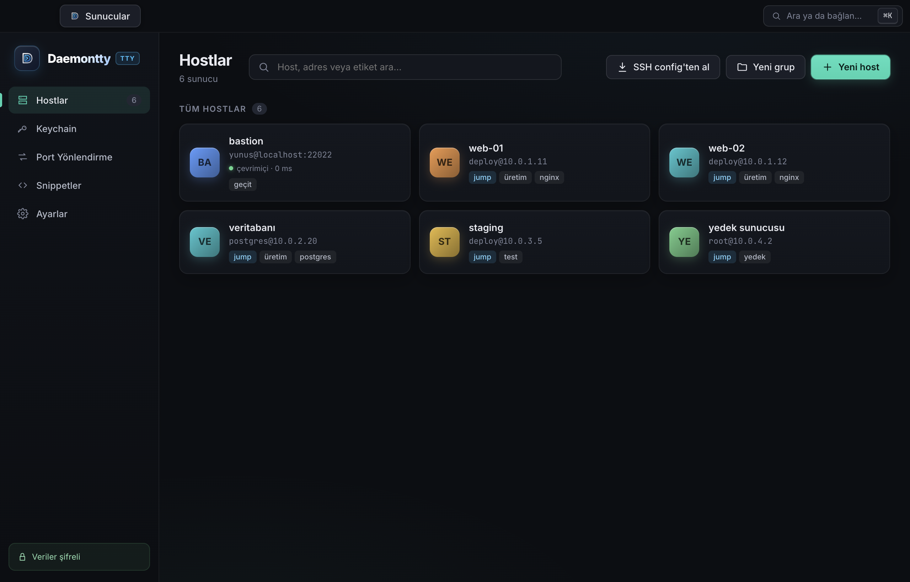
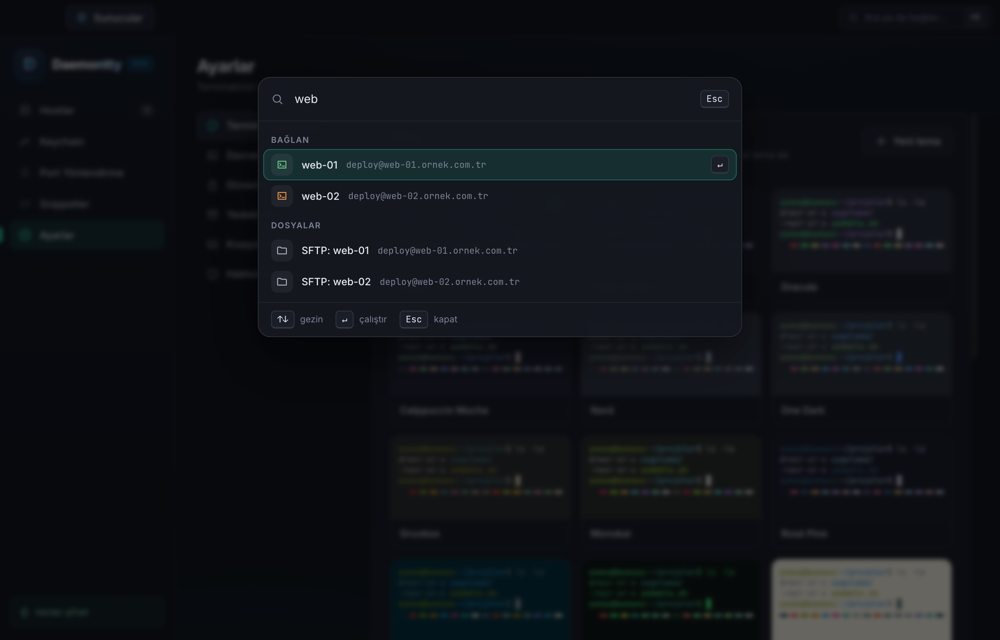
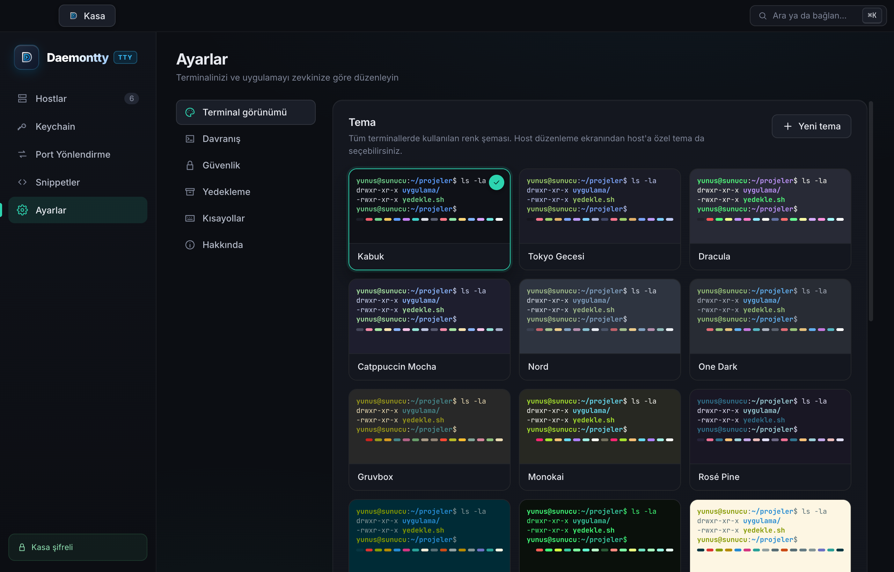

<div align="center">



# Daemontty

**Türkçe, açık kaynak SSH ve terminal istemcisi.**
Sunucularınız, anahtarlarınız, dosyalarınız ve tünelleriniz tek pencerede.

[](https://github.com/YunusEmreGok/daemontty/releases/latest)
[](https://github.com/YunusEmreGok/daemontty/releases)
[](LICENSE)


[**Kurulum**](#kurulum) · [Özellikler](#özellikler) · [Kısayollar](#klavye-kısayolları) · [Geliştirme](#geliştirme)

<br>



</div>

## Neden Daemontty?

Piyasadaki SSH istemcilerinin iyileri ücretli ve verinizi kendi bulutlarında tutuyor; ücretsizleri ise ya eski ya da İngilizce. Daemontty baştan sona Türkçe, hesabı ve bulutu yok: host'larınız, parolalarınız ve anahtarlarınız yalnızca kendi bilgisayarınızda, işletim sisteminin anahtar zinciriyle şifreli durur.

## Kurulum

Son sürümü [Releases sayfasından](https://github.com/YunusEmreGok/daemontty/releases/latest) alın.

| Platform | Dosya |
|---|---|
| **macOS** — Apple Silicon (M1 ve sonrası) | `Daemontty-x.y.z-arm64.dmg` |
| **macOS** — Intel | `Daemontty-x.y.z.dmg` |
| **Windows** 10/11 (64 bit) | `Daemontty-Setup-x.y.z.exe` |
| **Linux** — her dağıtım | `Daemontty-x.y.z.AppImage` |
| **Linux** — Debian / Ubuntu | `daemontty_x.y.z_amd64.deb` |

> [!NOTE]
> **macOS'ta ilk açılış.** Uygulama henüz Apple sertifikasıyla imzalı değil, bu yüzden macOS "hasarlı" ya da "geliştiricisi doğrulanamıyor" uyarısı verebilir. Uygulamayı Applications klasörüne taşıdıktan sonra Terminal'de bir kez şunu çalıştırın:
> ```sh
> xattr -cr /Applications/Daemontty.app
> ```
> Windows'ta SmartScreen uyarısı çıkarsa **Ek bilgi → Yine de çalıştır**.

**Güncellemeler.** Uygulama hiçbir şeyi kendiliğinden indirmez. Yeni sürüm çıkınca sorar; "şimdi değil" derseniz üst çubukta **Yeni sürüm mevcut** düğmesi kalır. Onay verdiğinizde güncelleme indirilir, sha512 özetiyle doğrulanır ve yeniden başlatırken kurulur (macOS, Windows ve Linux AppImage). Yalnızca `.deb` kurulumunda indirme sayfası açılır. İstediğiniz an **Ayarlar → Hakkında → Güncellemeleri denetle**.

## Özellikler

### Terminal
- **GPU hızlandırmalı** çizim (WebGL); yoğun log akışında bile akıcı. Yalnızca görünen sekmeler GPU belleği kullanır.
- **Bölünmüş ekran:** bir sekmede 4 panele kadar, isterseniz her panelde farklı sunucu.
- **Tümüne yaz:** yazdığınız her tuş bütün panellere aynı anda gider — on sunucuda aynı komutu tek seferde çalıştırın.
- **Akıllı otomatik tamamlama:** komut geçmişinizden, snippet'lerinizden ve sunucudaki gerçek dosya yollarından öneri; yanlış yazılan komutlar için "bunu mu demek istediniz?".
- **Otomatik yeniden bağlanma:** bağlantı koparsa artan aralıklarla dener, internet geri gelince beklemeden bağlanır.
- **Canlı sunucu durumu:** terminal çubuğunda CPU, RAM, disk ve sistem yükü.
- Terminal içi arama, tıklanabilir bağlantılar, seçince kopyalama, tam UTF-8 / Türkçe karakter desteği.

### Host yönetimi
- Gruplar, etiketler ve anlık arama; kartlarda **çevrimiçi durumu ve gecikme**.
- **Jump host (ProxyJump):** iç ağdaki sunuculara bastion üzerinden tek tıkla.
- `~/.ssh/config` dosyanızı **içe aktarma**.
- Host'a özel tema, bağlanınca otomatik çalışan başlangıç komutu, `ssh-agent` yönlendirme (`-A`).
- **Komut paleti** (`⌘K` / `Ctrl+Shift+K`): host'a bağlan, SFTP aç, snippet çalıştır — ya da doğrudan `kullanici@sunucu` yazıp kaydetmeden bağlan.

<div align="center"></div>

### SFTP dosya yöneticisi
- Çift panel; her panelin kaynağı seçilebilir: bu bilgisayar ya da herhangi bir sunucu.
- **Sunucudan sunucuya** doğrudan kopyalama.
- Sürükle-bırak yükleme, klasörleriyle indirme, canlı aktarım ilerlemesi.

### Anahtarlar ve kimlikler
- Uygulama içinde **Ed25519, RSA ve ECDSA** anahtar üretimi; mevcut anahtarları içe aktarma.
- Kimlikler: kullanıcı adı + parola/anahtar setini bir kez tanımlayıp birçok host'ta kullanın.
- `ssh-agent` ve `~/.ssh/id_*` anahtarlarını otomatik dener.
- Bilinen sunucular (parmak izi) listesi ve yönetimi.

### Port yönlendirme
**Yerel**, **uzak** ve **dinamik (SOCKS5)** tüneller; tek tıkla başlat/durdur, canlı durum.

### Görünüm
13 yerleşik tema (Kabuk, Tokyo Gecesi, Dracula, Catppuccin Mocha, Nord, One Dark, Gruvbox, Monokai, Rosé Pine, Solarized, GitHub Açık…) ve **kendi temanızı yapabileceğiniz düzenleyici**. JetBrains Mono ve Fira Code uygulamayla birlikte gelir.

<div align="center"></div>

## Güvenlik

- **Hesap yok, bulut yok, telemetri yok.** Uygulama yalnızca sizin sunucularınıza ve güncelleme denetimi için GitHub'a bağlanır.
- Kayıtlı verileriniz işletim sisteminin güvenli deposuyla şifrelenir: macOS Anahtar Zinciri, Windows DPAPI, Linux'ta libsecret / KWallet.
- **Şifreli yedek:** verilerinizi bir parolayla dışa aktarın (scrypt + AES-256-GCM), başka bir bilgisayarda birleştirerek ya da değiştirerek geri yükleyin.
- Arayüz süreci korumalı alanda çalışır (`sandbox`, `contextIsolation`); Node.js erişimi yoktur.
- Parolalar ekrana yansımadığı için otomatik tamamlama ve komut geçmişi onları hiçbir zaman görmez. Geçmiş kaydı ayarlardan tamamen kapatılabilir.

## Klavye kısayolları

| İşlem | macOS | Windows / Linux |
|---|---|---|
| Komut paleti | `⌘K` | `Ctrl+Shift+K` |
| Terminalde ara | `⌘F` | `Ctrl+Shift+F` |
| Ekranı sağa böl | `⌘D` | `Ctrl+Shift+D` |
| Ekranı aşağı böl | `⌘⇧D` | — |
| Paneli kapat | `⌘W` | `Ctrl+Shift+W` |
| Sonraki / önceki panel | `⌘]` / `⌘[` | `Ctrl+Shift+]` / `Ctrl+Shift+[` |
| Tüm panellere yaz | `⌘⇧B` | `Ctrl+Shift+B` |
| Kopyala / yapıştır | `⌘C` / `⌘V` | `Ctrl+Shift+C` / `Ctrl+Shift+V` |
| Sunucular (ana sayfa) | `⌘1` | `Ctrl+1` |
| Sekmeler arası geçiş | `⌘2`…`⌘9` | `Ctrl+2`…`Ctrl+9` |
| Yazıyı büyüt / küçült / sıfırla | `⌘+` / `⌘−` / `⌘0` | `Ctrl++` / `Ctrl+−` / `Ctrl+0` |
| Öneriyi kabul et | `Tab` ya da `→` | `Tab` ya da `→` |
| Sekmeyi kapat | Orta tık | Orta tık |

## Geliştirme

Node.js 22+ gerekir.

```sh
git clone https://github.com/YunusEmreGok/daemontty.git
cd daemontty
npm install
npm run dev          # canlı yenilemeyle geliştirme
npm run typecheck    # tip denetimi
```

Paketleme:

```sh
npm run dist:mac     # .dmg + .zip
npm run dist:win     # NSIS kurulum dosyası
npm run dist:linux   # AppImage + .deb
```

Kendi verilerinize dokunmadan denemek için ayrı bir veri klasörü verin:

```sh
DAEMONTTY_USER_DATA=/tmp/daemontty-test npm run dev
```

### Yapı

```
src/
├── main/        Electron ana süreci: SSH (ssh2), SFTP, tüneller, şifreli depolama, güncelleme
├── preload/     Arayüze açılan güvenli, tipli API köprüsü
├── renderer/    React 19 arayüzü, xterm.js terminal, otomatik tamamlama
└── shared/      Ana süreç ile arayüzün ortak tipleri
```

Electron · React 19 · TypeScript · xterm.js · ssh2 · electron-vite

### Sürüm çıkarma

```sh
npm run release
```

Sürüm numarasını artırır ve `v*` etiketini gönderir. GitHub Actions üç platformu derleyip [Releases](https://github.com/YunusEmreGok/daemontty/releases)'a yükler; kurulu uygulamalar bir sonraki denetimde yeni sürümü görür.

## Katkı

Hata bildirimi ve öneriler için [Issues](https://github.com/YunusEmreGok/daemontty/issues). Çekme istekleri memnuniyetle karşılanır — büyük değişikliklerden önce bir issue açıp konuşalım.

## Lisans

[MIT](LICENSE) © Yunus Emre Gök
